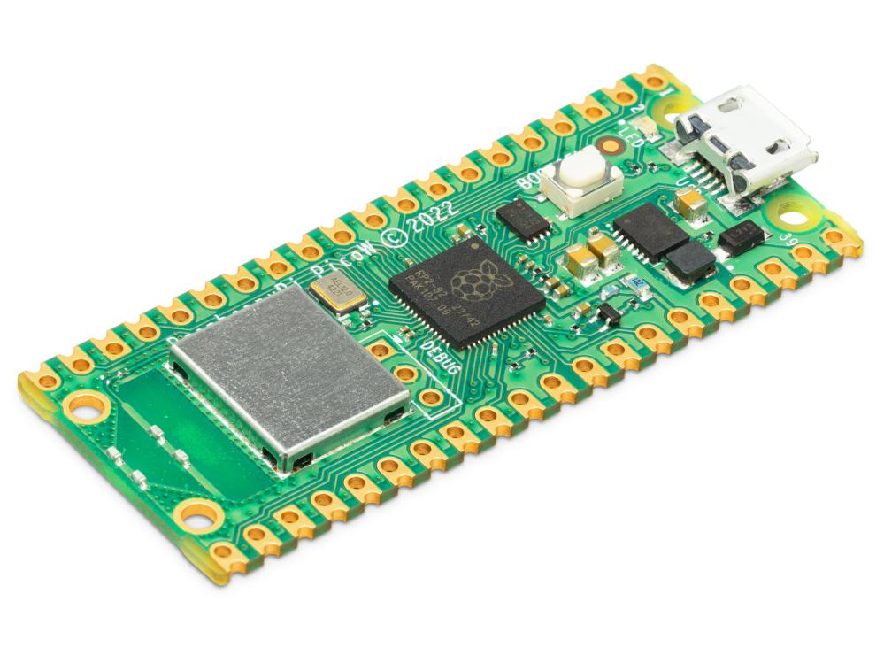
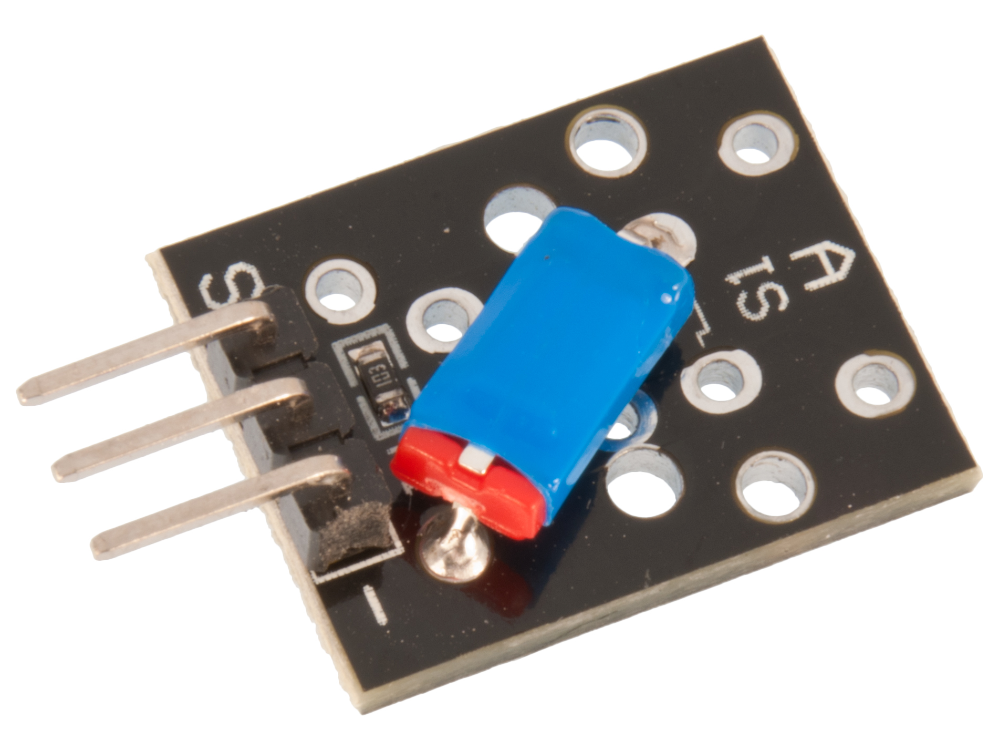
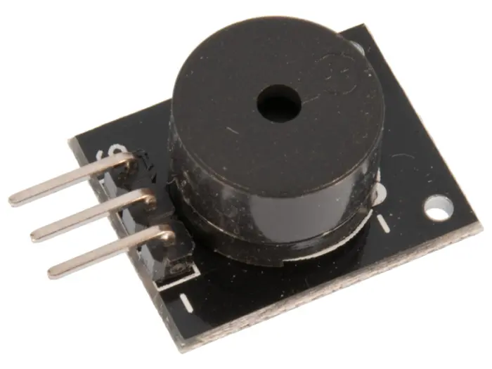
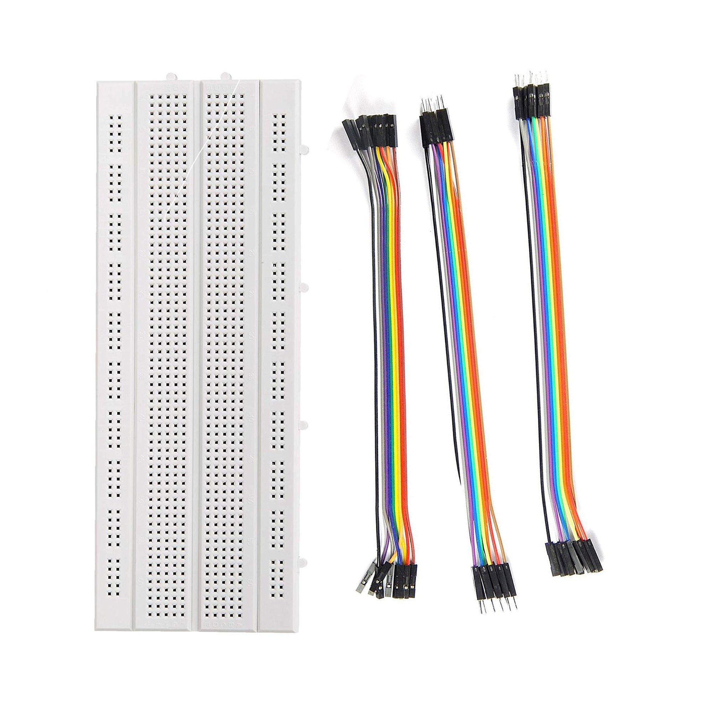
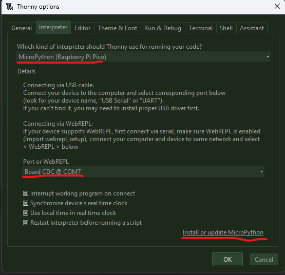
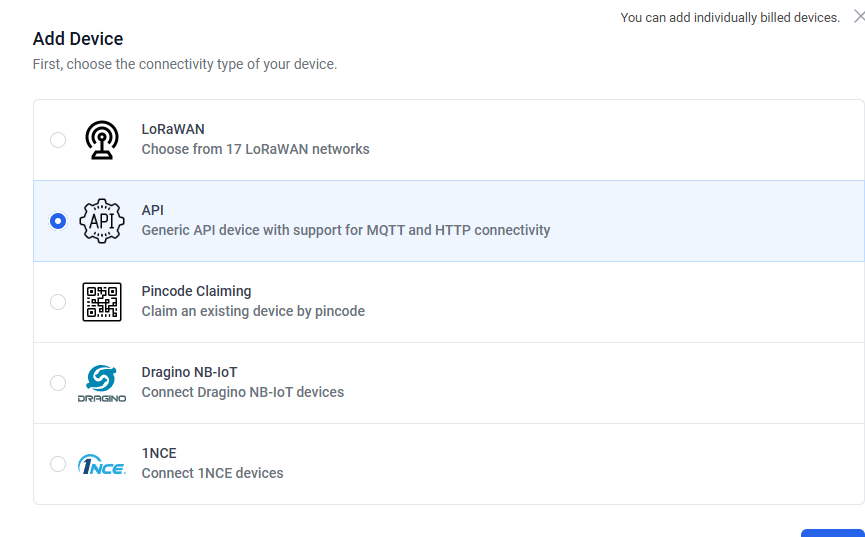
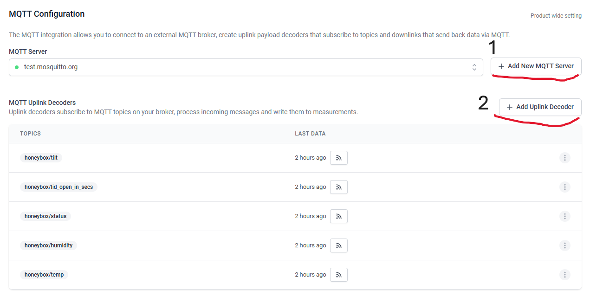
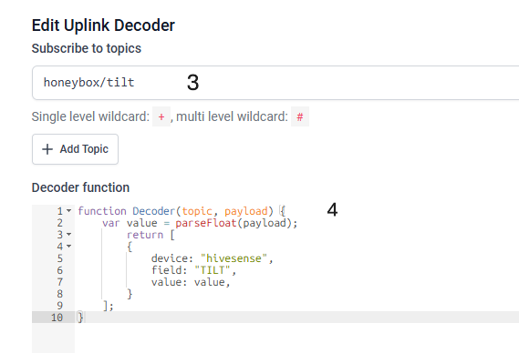
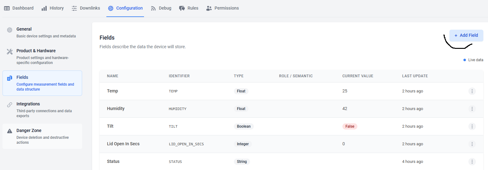
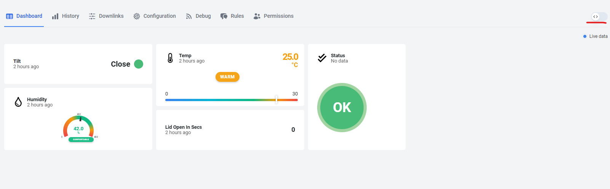

# HoneyBox – Smart Honey Storage Monitor

**Author:** Sadek Alashkar (sa225sd)  
**Date:** 2025-08-12  

---

## Overview

HoneyBox is an IoT system that monitors the environment of a honey storage box using temperature, humidity, and lid position sensors. It alerts the user via a buzzer when conditions are not optimal and sends live data to **Datacake** over MQTT.  

The system is based on the Raspberry Pi Pico W, programmed in MicroPython, and connects to Wi-Fi for real-time cloud updates.  

**Estimated time to build:** Approximately 3–4 hours, including setup, wiring, and testing, if you follow the tutorial step-by-step.

---

## Objective

### Why I chose the project
I wanted to create a device that ensures honey storage remains in perfect condition. Honey can spoil or lose quality if exposed to too much humidity, incorrect temperatures, or if the container remains open for too long.  

### What purpose it serves
The HoneyBox continuously monitors:
- Temperature (alerts if too warm or cold)
- Humidity (alerts if high)
- Lid position (alerts if open too long)

### Insights it provides
- Helps maintain optimal honey quality
- Identifies if storage practices are causing temperature or humidity fluctuations
- Tracks lid usage to prevent prolonged exposure to air and moisture

---

## Materials
NOTE: I already had most of the starter kit materials, like the Pico, breadboard, etc. However, I lacked some sensors, so I bought a sensor kit. You can buy all the materials from Electrokit or any other place you prefer.
| Component | Purpose | Specs | Cost | Source |
|-----------|---------|-------|------|--------|
| [Start kit 349kr](img/https://www.electrokit.com/lnu-starter) | Main material | All you need to get started | 349 kr | elctro:kit |
| [Sensor kit 299kr](img/https://www.electrokit.com/sensor-kit-25-moduler) | Additional Sensors | 24 additional sensors | 299 kr | elctro:kit |
| Raspberry Pi Pico WH | Main controller with Wi-Fi | 133 MHz dual-core ARM Cortex M0+, 2 MB Flash | startkit | elctro:kit |
| DHT11 Module | Temperature & humidity sensor | 0–50°C ±2°C, 20–90% RH ±5% | startkit/sensorkit | elctro:kit |
| Tilt Switch Module | Detects lid open/close | Digital output | startkit/sensorkit | elctro:kit |
| Active Buzzer Module | Audio alerts | Active 5V/3.3V | sensorkit | elctro:kit |
| Jumper wires | Connections | Male-to-Male | startkit/sensorkit | elctro:kit |
| Breadboard | Prototyping | 840 tie-points | startkit | elctro:kit |
| USB-cable | Connections | USB A to micro B | startkit | elctro:kit |


**Raspberry Pi Pico WH**: The main microcontroller board with built-in Wi-Fi, used to read sensors, run logic, and send data to the MQTT.  


**DHT11**: A temperature and humidity sensor module used to measure the environmental conditions inside the honey storage box.  


**Tilt Switch Module**: Detects whether the honey box lid is open or closed, triggering alerts if left open too long.  


**Active Buzzer**: Produces audible alerts for different warning and alert conditions (too warm, too cold, high humidity, or open lid).  
NOTE: it's an active buzzer not passive one (where a passive buzzer needs a ~330ohm resistor) 


**Breadboard & Jumper Wires**: Used easliy for prototyping and connecting all components without soldering.  


---

## Computer Setup

- **IDE:** Thonny (for MicroPython development)
- **Firmware:** MicroPython for Raspberry Pi Pico W
- **Steps:**
  1. Download and install Thonny IDE
  2. Install MicroPython firmware on Pico W via Thonny (`Tools` → `Options` → `Interpreter`)
  3. Connect Pico W via USB, select correct COM port
  
  4. Install `mqtt_as` library for MQTT connectivity (from repo)
  5. Upload main script to Pico (`main.py` from repo)

---

## Putting Everything Together

**Connections:**

| Module | Pin | Pico Pin |
|--------|-----|----------|
| DHT11 | VCC | 3V3(OUT) |
|       | GND | GND |
|       | DATA | GP15 |
| Tilt Switch | VCC | 3V3(OUT) |
|             | GND | GND |
|             | SIG | GP14 |
| Active Buzzer | VCC | 3V3(OUT) |
|               | GND | GND |
|               | SIG | GP6 |


- Powered via Pico W’s 3.3V output
- No external resistors needed for these modules
- Breadboard used for easy prototyping

---

## Platform

- **Platform:** Datacake (cloud)
- **Reason for choice:** Free tier supports MQTT configration, has a visual dashboard builder, and supports triggers/automation
- **Scalability:** Can easily add more sensors or multiple HoneyBoxes, since Datacake supports multiple devices and dashboards

---

## The Code

**Core functionalities:**
- Uses Pico W’s dual-core CPU:
  - **Core 1:** Continuously reads sensors and updates shared variables
  - **Core 0:** Publishes each metric to its own MQTT topic (`honeybox/temp`, `honeybox/humidity`, etc.)
- Simple threshold logic determines status (`ok`, `warn`, `alert`)
- Publishes every 5 seconds (for testing otherwise 2-3 hour)

**Snippet:**
```python

# ======== CORE 1: SENSOR LOOP ========
def core1():
    global temperature_c, humidity, tilt_state, lid_open_in_secs, lid_state, lid_open_started

    while True:
        # Read DHT
        try:
            sensor.measure()
            with lock:
                temperature_c = sensor.temperature()
                humidity = sensor.humidity()
            print(f"[Core1] Temp={temperature_c}C Hum={humidity}%")
        except Exception as e:
            print("[Core1] DHT Error:", e)

        # Read Tilt (lid)
        ones = 0
        for _ in range(8):
            ones += tilt.value()
            time.sleep_ms(5)
        avg = ones / 8
        active = (avg < 0.5) if TILT_ACTIVE_LOW else (avg > 0.5)
        with lock:
            tilt_state = 1 if active else 0

        now = time.ticks_ms()
        if tilt_state == 1 and lid_state == 0:
            if lid_open_started is None:
                lid_open_started = time.time()
            lid_state = 1
            print("[Core1] Lid Opened") # Debug print, good to have
        elif tilt_state == 0 and lid_state == 1:
            lid_state = 0
            if lid_open_started:
                dur = int(time.time() - lid_open_started)
                print(f"[Core1] Lid Closed after {dur}s")
                lid_open_started = None

        with lock:
            lid_open_in_secs = int(time.time() - lid_open_started) if lid_open_started else 0

        # Buzzer events
        if temperature_c is not None and temperature_c < TEMP_OK_MIN:
            buzzer_event("cold")
        if temperature_c is not None and temperature_c > TEMP_OK_MAX:
            buzzer_event("warm")
        if lid_open_in_secs > 0:
            buzzer_event("lid")
        if humidity is not None and humidity > RH_ALERT:
            buzzer_event("humid")

        time.sleep(1)
```

---

## Transmitting the Data / Connectivity

- **Protocol:** Wi-Fi + MQTT (via `mqtt_as` library)
- **MQTT Broker:** `test.mosquitto.org` (public test broker)
- **Topics:**
  - `honeybox/temp`
  - `honeybox/humidity`
  - `honeybox/tilt`
  - `honeybox/lid_open_secs`
  - `honeybox/status`
- **Publish rate:** every 5 seconds
- **Reason for MQTT:** Lightweight, reliable for IoT, works with Datacake’s MQTT configration

---

## Presenting the Data

**Datacake Setup:**
1. Create API Device, then choose new prject, free plan.

2. Go to `Configration` → `Product & Hardware` → scroll down to `MQTT Configration` → Add fields for each topic

3. Link each field to correct MQTT topic (`honeybox/temp`, etc.)

```json
    function Decoder(topic, payload) {
        var value = parseFloat(payload);
            return [
            {
                device: "hivesense", // device serial number
                field: "TILT", //change the field name
                value: value,
            }
        ];
    }
```
4. Add the fields.

4. Build a dashboard with:
   - Live temperature gauge
   - Humidity gauge
   - Lid status indicator
   - Status text widget
   - Historical graphs

   Activate the edit mode → choose your fav widget → `Data` → select the field you created in prev step


Data is stored in Datacake’s database and can be exported for analysis. Triggers can be set up to send notifications when `status` is `alert`.

---

## Finalizing the Design

Since I have the “Honey Box” in the basement, I will use a cable with a 25W adapter (normal phone adapter) connected directly to the electrical outlet, glued to the bottom of the lid. I don’t have a 3D printer, so I will skip making a custom case; otherwise, the project would ideally need a case for safety.


### Final thoughts:
- **What worked well:** Dual-core separation kept sensor reads smooth and alerts responsive; MQTT per-topic design simplified Datacake integration.
- **Possible improvements:**
  - Use DHT22 for better accuracy
  - Add battery power and sleep mode for portable setups
  - 3D printed case for safety.
  - Add remote control via MQTT downlink (e.g., manually triggering buzzer)

The HoneyBox is ready for use in real honey storage environments, ensuring that conditions remain optimal for long-term quality.

---
